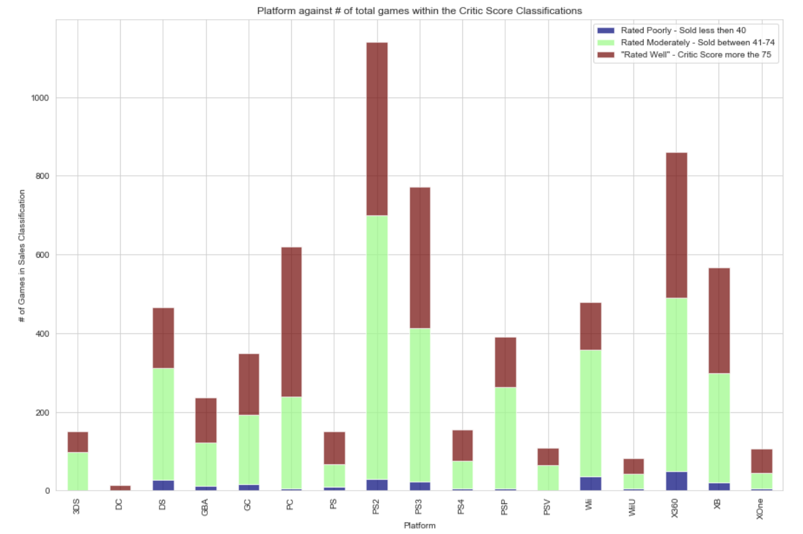

# Video Game MetaCritic Score Predictor

Video Game Critic Score Predicting models and Bonus models for Global Sales

Flatiron-Project-4-Video Game Critic Score

For my fourth project in Flatiron I wanted to see if I can make a machine learning model to predict a video game's Metacritic score based on the data I selected. Found data on a little more than 6500 games; with data on sales records, year released, Metacritic score, genre and which platform it came out on. I had to also merge all same titles into one common row and combined all games that were released on multiple platforms. After this my total data set went down to about 4300 data points.

## What Did I Do?

* Imported .cvs file, and api called for missing data

* Cleaned .csv file and grouped same games sold on different platform together.

* Created Dummies variables for non-numerical data (for columns : Genre, Metacritic Score, Rating, etc.) so we can work with these data.

* Visualized all data against each other to see if we can find any solid correlations

* Found some correlations between categories.

* Split the Critic score into 3 groups; for classification:
- 1 if score is equal to OR less then 40
- 2 if score is in between 51 and 74
- 3 if score is equal to OR more then 75

* Split the Global  sales into 3 groups; for classification:
- 1 if sold equal to OR less then 1.50 million
- 2 if sold in between 1.51 million and 7.49 million
- 3 if score is equal to OR more then 7.5 million

* I then trained my data to a few models (Logistic Regression, K-Nearest Neighbors, RandomForest, and Support Vector Classification, Bagging Trees, Decision Tree and BernoulliNB)

* After testing i ran some precision test(f1_score, precision_score, accuracy_score, etc.) and then I made a confusion matrix for each model to show the relationship between the 3 classifications and the probability of the outcome.

* Finally I showed all results of the tested models in a neat table.

I was looking for either precision or F1 Score for the determining outcome; F1 Score would be a better measure to use if we need to seek a balance between Precision and Recall (taking account for False Positive and True Negatives errors).

The results showed KNN (K-Nearest Neighbors = 3) actually preformed the best across the board(except accuracy_score using cross validation; which again is fine, looking more for precision or F1 score).

It seems K-Nearest Neighbors was the best because, based on the features I used, the model was trained to  picks similar values( within 3) to the features of a known MetaCritic scores to base the predictions on.

## Built With

* Python3.8
* Jupyter Notebook 6.0.0
* A few imports: pandas, numpy, matplotlib.pyplot, seaborn, statsmodels and sklearn

## Authors

* **Samuel Diaz** - *Creator* - [sdman135](https://github.com/sdman135/)
