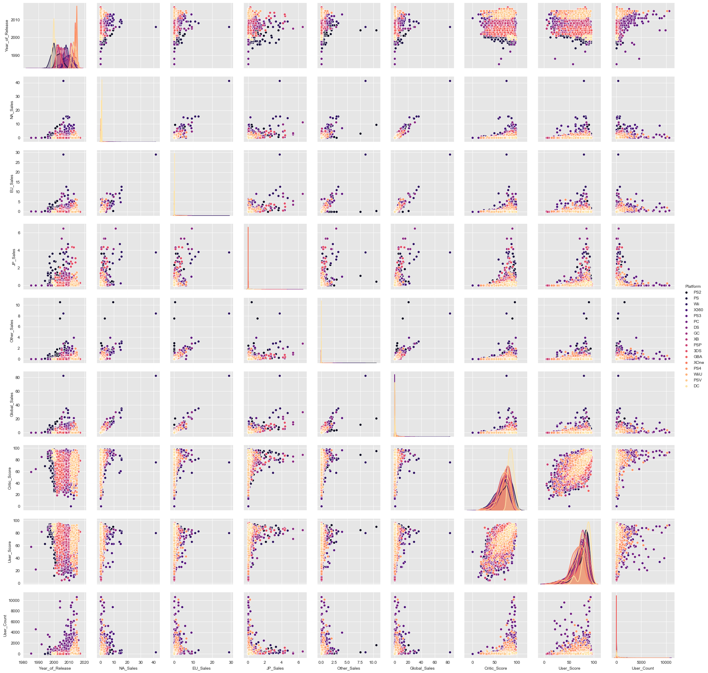
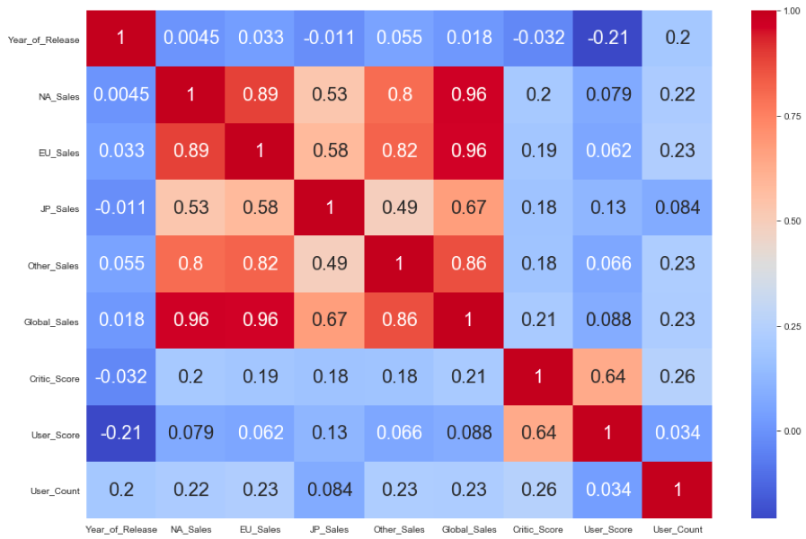
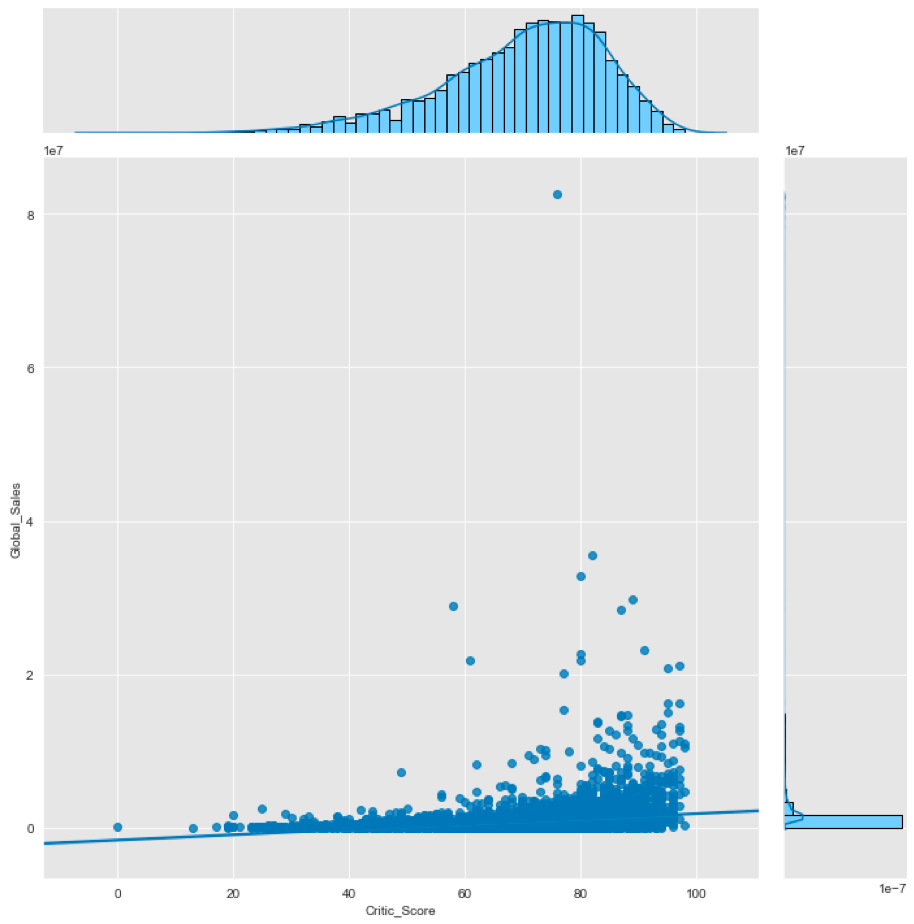
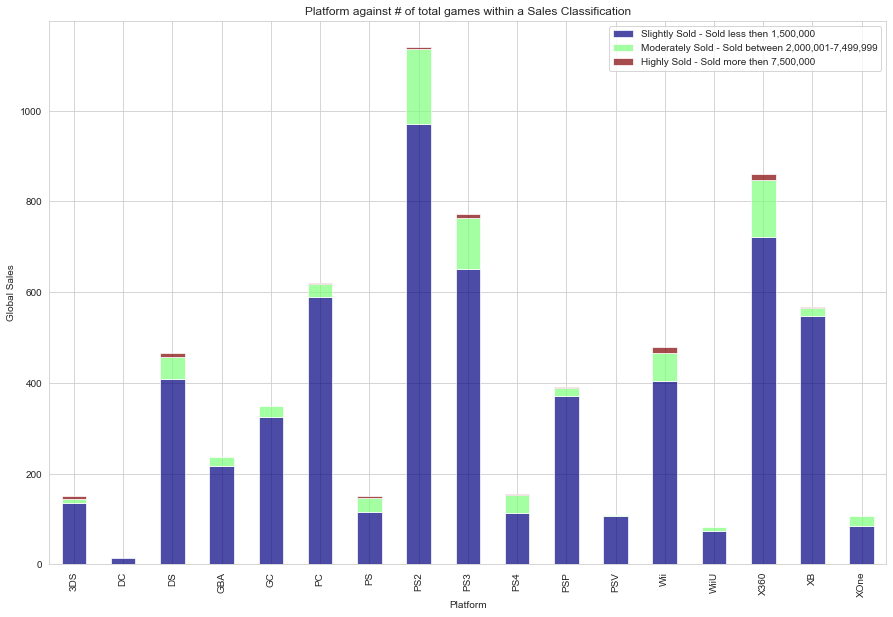
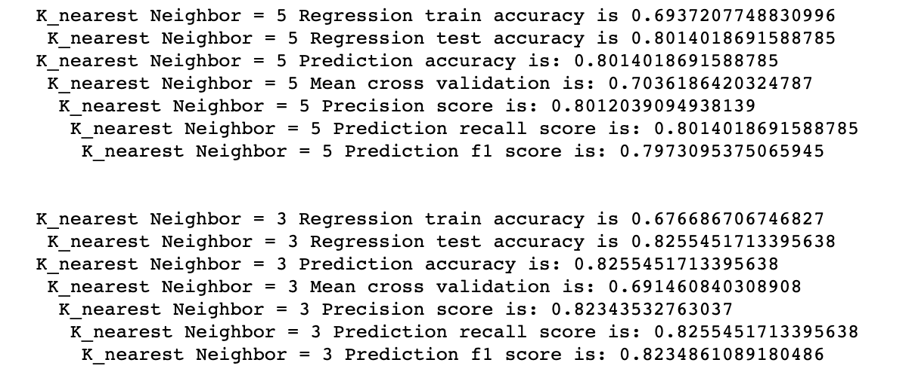
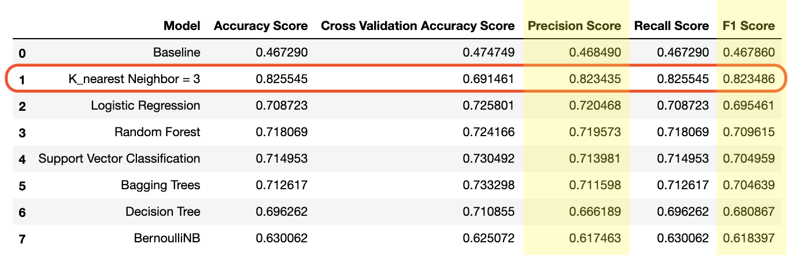

# Flatiron-Project-4-Video Game Critic Score

Video Game Critic Score Predicting models and Bonus models for Global Sales

Project-4-Video Game Critic Score

For my fourth project in Flatiron I wanted to see if i can make a mac hine learning model to predict if a game's Metacritic score based on the data i selected. I found data on alittle more then 6500 games; with sales records, year released, Metacritic score, genre and which platform it came out on. I had to also merge all same titles into one row and combine all the platfroms tat released the game.

## What Did I Do?

* Imported .cvs file, and api called for missing data

* Cleaned .csv file and grouped games sold on different platform together .

* Created Dummies variables for non-numerical data (for columns : Genre, Metacritic Score, Rating, etc.) so we can work with these data.

* Visualized all data against each other to see if we can find any solid correlations

* Found correlations between each category.

* Split the Critic score into 3 groups; for classification:
1 if score is equal to OR less then 40
2 if score is in between 51 and 74
3 if score is equal to OR more then 75

* Split the Global  sales into 3 groups; for classification:
1 if sold equal to OR less then 2.00 million
2 if sold in between 2.01 million and 7.49 million
3 if score is equal to OR more then 7.5 million

* I then applied a few training models (Logistic, K-Nearest Neighbors, RandomForest, and Support Vector Classification just to name a few)

* After testing i ran some precision test(f1_score, precision_score, accuracy_score, etc.) and then I made a confusion matrix for each model to show the relationship between the 3 classifications and the probability of the outcome.

* Finally I showed all results of the tested models in a neat table.

The results showed K-Nearest Neighbors @ 3 preformed the best across the board

## Built With

* Python3.8
* Jupyter Notebook 6.0.0
* A few imports: pandas, numpy, matplotlib.pyplot, seaborn, statsmodels and sklearn

## Authors

* **Samuel Diaz** - *Creator* - [sdman135](https://github.com/sdman135/)
